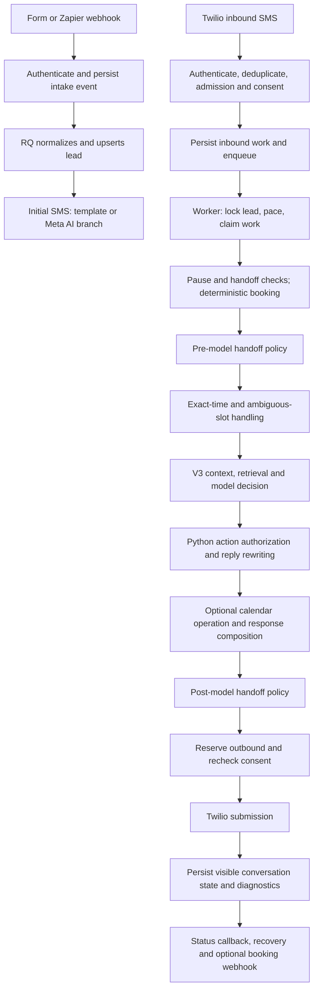

# Agent workflow and behavior audit

Reviewed 2026-10-08. Scope: the current local working tree, including pre-existing uncommitted changes. This is a code trace and offline validation, not verification of the deployed revision or live tenant configuration. No application behavior was changed.

> Follow-up implementation: initial outreach is now shared between Test Lab and the real worker in `app/services/initial_outreach.py`. The source/operating-hours opening branches described below were removed, along with new scheduling of their after-hours template follow-up. Source attribution is excluded from model context. Safe retries reuse reserved opening text and memory. The subsequent 24/7 cleanup also retired legacy queued follow-up jobs, prevented recovery from resending failed after-hours messages, removed the hours-check helper/configuration, and removed the pending-hours inbox tag. Sections 5, 18 and 19 describe the pre-change behavior audited here; other findings remain separate work.

## 1. Architecture and actual entry point

FastAPI handles HTTP, SQLAlchemy/PostgreSQL hold durable records, Redis/RQ execute background jobs, Twilio carries SMS, and an OpenAI provider produces structured decisions. React exposes configuration and operator controls; it does not run the agent.

The active factory returns `LLMAgentV3`. `llm_agent.py` is a compatibility export. The V4 document describes intended future architecture; it is not the current production router.

Sources: [factory](/Users/petersarateanu/Documents/prog/fghl/highlevel_is_a_scam/app/services/agent_v3.py:2168), [compatibility module](/Users/petersarateanu/Documents/prog/fghl/highlevel_is_a_scam/app/services/llm_agent.py), [deployment](/Users/petersarateanu/Documents/prog/fghl/highlevel_is_a_scam/docker-compose.yml), [V4 plan](/Users/petersarateanu/Documents/prog/fghl/highlevel_is_a_scam/docs/chatbot-v4-implementation-plan.md).



Many branches terminate early: STOP, HELP, paused conversations, deterministic booking, handoffs, identity questions, and provider failures do not all reach the model.

## 2. What dictates behavior

| Layer | Controls | Authority / effect |
| --- | --- | --- |
| Python transport and delivery | Signature, tenant, consent, opt-out, deduplication, rate limits, reservations | Can prevent processing or sending |
| Python conversation orchestration | Pause, pre/post handoff, active offers, booking confirmation, delivery uncertainty | Can bypass the model or replace its outcome |
| Python decision policy | Scheduling authorization, qualification, intent score, meeting invitation timing, output cleanup | Can force/remove tools, actions, questions, or entire replies |
| Hardcoded system prompts | Identity, answer-first policy, conversion objective, language, tool contract, factual rules | Instructions supplied to the model |
| Tenant configuration | Business name, tone, AI playbook, FAQ, calendar, templates, language | Data and configurable behavior within hardcoded boundaries |
| Website knowledge | Business profile plus query-specific source snippets | Factual context, not an executable instruction source |
| Conversation state | Form facts, recent messages, qualification memory, CTA history, active slots | Conditions the current decision |
| Model | Proposed conversational act, wording, extracted fields and tool request | Proposal, subject to all downstream checks |

The system security policy labels **every value in the user JSON**, including tenant AI context and FAQ, untrusted and says only system rules define behavior. Elsewhere, the same prompt tells the model to use `ai_context` for positioning and do/don't-say guidance. This creates tension between tenant customization and the global instruction boundary.

Sources: [security policy](/Users/petersarateanu/Documents/prog/fghl/highlevel_is_a_scam/app/services/agent_v3.py:140), [main prompt](/Users/petersarateanu/Documents/prog/fghl/highlevel_is_a_scam/app/services/agent_v3.py:881), [decision sanitation](/Users/petersarateanu/Documents/prog/fghl/highlevel_is_a_scam/app/services/agent_v3.py:1224), [action authorization](/Users/petersarateanu/Documents/prog/fghl/highlevel_is_a_scam/app/services/agent_v3.py:1618).

## 3. Configuration and provider selection

Global AI settings are `openai_api_key`, `openai_model`, and `ai_provider_mode`, loaded from `runtime_settings` over environment defaults. OpenAI configuration is global, not a separate model configuration per tenant. Nonempty client provider settings override deployment fallbacks for Twilio, public URL, language, and webhook settings.

The code default model is `gpt-5.4-mini`; the effective deployed model may differ. This review did not retrieve live database overrides or secrets.

Live modes: `auto`, `openai`, `gpt`, `live`. Disabled modes: `heuristic`, `off`, `disabled`, `none`. A missing key or disabled mode selects `UnavailableLLMProvider`; the resulting exception enters the deterministic fallback. Thus “heuristic” disables OpenAI but does not globally silence the chatbot.

Tenant fields include business name, tone, `ai_context`, `faq_context`, timezone, operating hours, booking configuration, booking URL, consent text, handoff number, and template overrides.

Sources: [runtime precedence](/Users/petersarateanu/Documents/prog/fghl/highlevel_is_a_scam/app/services/runtime_config.py:63), [factory](/Users/petersarateanu/Documents/prog/fghl/highlevel_is_a_scam/app/services/agent_v3.py:2168), [defaults](/Users/petersarateanu/Documents/prog/fghl/highlevel_is_a_scam/app/core/config.py:8), [client model](/Users/petersarateanu/Documents/prog/fghl/highlevel_is_a_scam/app/db/models.py:78).

## 4. Lead intake

The supported external intake routes are `POST /webhooks/form/{client_key}` and `POST /webhooks/zapier/{client_key}`. Direct Meta/LinkedIn callbacks are retired, although source enums and legacy normalization branches remain.

The route authenticates the tenant submission, bounds the payload, validates actionable lead data, and persists an inbox event before queueing work. CRM authentication supports timestamped HMAC and compatible secret headers. The documented limits are 128 KiB and 10 normalized leads; the signed replay window is five minutes.

The worker normalizes names, phone/email, arbitrary form answers, external identifiers, language, and consent evidence. It upserts tenant-scoped leads and enqueues eligible initial SMS. A unique tenant/external-lead identity and additional lookup handling reduce duplicates.

Form consent defaults to false. Missing consent on a later update does not withdraw already captured consent; explicit withdrawal does. First SMS requires a phone, consent, no opt-out, and no prior initial send. The initial task also skips if conversation timestamps show messaging has already started.

Sources: [routes](/Users/petersarateanu/Documents/prog/fghl/highlevel_is_a_scam/app/api/routes_webhooks.py:926), [normalization](/Users/petersarateanu/Documents/prog/fghl/highlevel_is_a_scam/app/services/lead_intake.py:441), [upsert](/Users/petersarateanu/Documents/prog/fghl/highlevel_is_a_scam/app/services/lead_intake.py:527), [worker](/Users/petersarateanu/Documents/prog/fghl/highlevel_is_a_scam/app/workers/tasks.py:637).

## 5. Initial outreach is a separate workflow

In `send_initial_sms_task`:

- `LeadSource.META`: constructs a synthetic form-summary input and calls `next_reply(..., history=[])`. That wrapper passes no database or booking service, so it has no query-specific database retrieval or tool execution.
- Other sources during operating hours: render `initial_sms`.
- Other sources outside operating hours: render `after_hours` and schedule a follow-up.

The English default initial template is:

> Hi {first_name}, I'm {assistant_name}, the assistant for {business_name}. Thanks for reaching out. I can help you quickly. {consent_text}

The assistant name is hardcoded to **Hermes**. French templates are supplied separately. Client template overrides are merged, then the localized key takes precedence over the generic key.

Ordinary form/Zapier outreach therefore does not automatically receive the same customized AI opening that Test Lab demonstrates. Operating hours affect this initial-template branch; there is no equivalent blanket after-hours stop in the normal inbound AI turn.

Source: [initial task](/Users/petersarateanu/Documents/prog/fghl/highlevel_is_a_scam/app/workers/tasks.py:1474), [templates](/Users/petersarateanu/Documents/prog/fghl/highlevel_is_a_scam/app/templates/default_messages.yml), [template resolution](/Users/petersarateanu/Documents/prog/fghl/highlevel_is_a_scam/app/services/sms_service.py:202).

## 6. Inbound SMS admission and compliance

`POST /sms/inbound/{client_key}`:

1. Resolve an active client and effective Twilio settings.
2. Bound/parse the provider form; verify signature and expected account/number.
3. Require normalized sender and `MessageSid`.
4. Deduplicate the provider SID. A duplicate can re-enqueue recoverable work without creating a second conversation turn.
5. Apply tenant/shared-account admission limits, then per-lead rate controls.
6. Find or create a tenant-scoped lead. A newly initiated inbound SMS lead records inbound consent.
7. Persist the inbound message and process compliance.
8. Queue MMS retrieval if needed, otherwise queue normal inbound work.
9. Return empty TwiML; the normal outbound reply is a separate provider send.

STOP revokes consent, sets opt-out and records the prior state for restoration. START restores permission/state when resubscribing. HELP uses template copy. Known-lead STOP/START state changes can survive admission failure while suppressing replies. Opted-out messages do not reach ordinary agent processing.

Defaults differ by entry environment: Python settings use a per-lead limit of 100/minute, while Compose defaults to 4/5 minutes. Tenant/account defaults are 120/600 callbacks per 60 seconds. Effective environment values matter.

Sources: [inbound endpoint](/Users/petersarateanu/Documents/prog/fghl/highlevel_is_a_scam/app/api/routes_sms.py:587), [compliance](/Users/petersarateanu/Documents/prog/fghl/highlevel_is_a_scam/app/services/compliance.py), [admission](/Users/petersarateanu/Documents/prog/fghl/highlevel_is_a_scam/app/services/twilio_inbound_admission.py).

## 7. Worker scheduling and ordered turn orchestration

The worker uses a lead workflow lock, requeues lock contention, applies pacing, claims durable inbound work, checks prior processing and SMS permission, loads current provider configuration, then calls `process_inbound_turn`.

Automated pacing defaults to 20 seconds and considers inbound creation and previous outbound time. This is a delay mechanism, not evidence of a full multi-message debounce/merge strategy. Recovery jobs reclaim recoverable inbound work and reconcile stale outbound reservations.

The turn's actual order is:

1. Load up to 40 recent messages; extract a missing email; remember language.
2. Suppress ordinary replies for paused, handed-off, or opted-out leads.
3. If booking-offer delivery is uncertain, hand off to avoid selecting from a possibly unseen menu.
4. Try deterministic pending-reschedule and eligible slot-selection handling.
5. Evaluate pre-model handoff.
6. Try deterministic exact-time requests and booking commitments.
7. If appropriate, use the smaller LLM slot-resolution contract.
8. Run the full V3 turn.
9. Handle empty/repeated-offer replies, evaluate post-model handoff, reconcile state/action, send, persist.

The order is significant: some deterministic booking branches run before pre-model handoff, and many other branches return before the main planner.

Sources: [worker](/Users/petersarateanu/Documents/prog/fghl/highlevel_is_a_scam/app/workers/tasks.py:1308), [orchestrator](/Users/petersarateanu/Documents/prog/fghl/highlevel_is_a_scam/app/services/inbound_sms.py:1701), [agent controls](/Users/petersarateanu/Documents/prog/fghl/highlevel_is_a_scam/app/services/agent_control.py:15).

## 8. Context and memory sent to the model

V3 rebuilds context on each turn. It combines persisted qualification memory with extraction from form answers, loaded history, and the latest inbound message.

Context includes business/FAQ/playbook, website profile, retrieved snippets, language, form facts, acknowledged facts, internal lead summary, recent messages, workflow/CRM state, known/missing qualification, asked/answered questions, active slot offer, time preferences, intent score, call refusal, pricing-question flags, CTA history, and available tools.

Important bounds:

| Item | Bound |
| --- | ---: |
| Latest inbound in main planner | 2,000 characters |
| Messages in main model context | Last 12 |
| Body per model-context message | 800 characters |
| FAQ, AI context, business profile context | Up to 8,000 characters each |
| Generic nested prompt value | Usually 1,200 characters/string, 40 items/collection, depth 5 |
| Retrieved knowledge | Up to 4 snippets, 700 characters each, total block budget 2,600 |
| Agent reply ceiling | 1,600 characters |

Prompt sanitizers redact direct contact patterns and omit direct-contact keys in bounded data. This is not a guarantee of complete anonymization: names, city and relevant project content are still included.

There is no complete conversation replay to the model and no OpenAI-hosted conversation thread in this path. Longer-term continuity depends on selected JSON memory and bounded history.

Sources: [context builder](/Users/petersarateanu/Documents/prog/fghl/highlevel_is_a_scam/app/services/agent_v3.py:1004), [limits](/Users/petersarateanu/Documents/prog/fghl/highlevel_is_a_scam/app/services/agent_v3.py:36), [memory persistence](/Users/petersarateanu/Documents/prog/fghl/highlevel_is_a_scam/app/services/inbound_sms.py:841).

## 9. Website knowledge

A dedicated knowledge worker crawls owner-supplied public URLs, extracts readable HTML, forms/options, metadata and JSON-LD, chunks content and stores tenant-scoped sources. It does not execute JavaScript.

Limits include 12 URLs per ingestion and 48 stored sources per client. Failed refreshes can retain last-successful content for query-specific retrieval for up to 30 days; stale content is excluded from always-on business memory.

At turn time, the retrieval query prioritizes the latest request and can use recent conversational references plus relevant form facts. Retrieval uses PostgreSQL full-text/metadata matching with weighted lexical scoring and a non-Postgres fallback. This path is not embedding/vector search.

The model receives an always-on derived business profile plus source-labelled relevant excerpts. Retrieval diagnostics retain source IDs, titles, scores and status.

Sources: [ingestion](/Users/petersarateanu/Documents/prog/fghl/highlevel_is_a_scam/app/services/knowledge.py:271), [retrieval](/Users/petersarateanu/Documents/prog/fghl/highlevel_is_a_scam/app/services/knowledge.py:799), [context assembly](/Users/petersarateanu/Documents/prog/fghl/highlevel_is_a_scam/app/services/knowledge.py:988), [query construction](/Users/petersarateanu/Documents/prog/fghl/highlevel_is_a_scam/app/services/agent_v3.py:294).

## 10. Hardcoded conversational policy

The main prompt says Hermes should answer questions, qualify naturally and move qualified leads toward an expert meeting. It specifies:

- Disclose assistant identity; never impersonate the owner or a human employee.
- Answer a lead's question before guiding toward another step.
- Usually write one or two short sentences; ask at most one follow-up question.
- Do not repeat known form facts or previously answered questions.
- Introduce the assistant on initial outreach only.
- Match English/French response language.
- Avoid repeated meeting invitations; respect refusal.
- Never ask about budget.
- Only discuss pricing when the AI context passes the explicit-pricing check.
- Use backend-provided availability and never invent confirmations.
- Escalate certain human, complaint, binding commitment, quote, uncertainty and media requests.

These are partly prompt instructions and partly enforced Python behavior; they are not guaranteed outcomes merely because the prompt contains them.

The saved `client.qualification_questions` is not read by V3's context/question-selection code. The structured `next_question_key` choices are hardcoded to `decision_makers` and `urgency_driver`; helper definitions add generic missing-field prompts such as outcome, request type, timeline and decision process.

Sources: [main prompt](/Users/petersarateanu/Documents/prog/fghl/highlevel_is_a_scam/app/services/agent_v3.py:881), [question definitions](/Users/petersarateanu/Documents/prog/fghl/highlevel_is_a_scam/app/services/agent_v3_types.py:185), [pricing gate](/Users/petersarateanu/Documents/prog/fghl/highlevel_is_a_scam/app/services/agent_v3_helpers.py:876).

## 11. Intent scoring and meeting pressure

Python calculates the score; this is not simply the model's subjective classification:

| Signal | Score |
| --- | ---: |
| Known service/request need | +2 |
| Specific form scope | +2; otherwise some form context +1 |
| Known timeline | +1 |
| Urgent timeline | +2 |
| Known decision path | +1 |
| Decision-maker wording | +1 |
| Location context | +1 |
| Meaningful scale/scope | +1 |
| Pricing question | +2 |
| Booking/scheduling intent | +3 |
| Buying signal | +2 |
| Low-intent language | -3 |

High intent begins at 6; medium at 3; otherwise low. Explicit low-intent language and prior meeting history further affect classification.

For a high-intent lead with a known core need and at least one prior outbound, Python forces the first explicit expert-call invitation when no prior invitation/suppression, refusal, booking, handoff or current scheduling intent prevents it. Optional qualification must not postpone that invitation. It may replace the model's draft and is reasserted after final reply guardrails.

CTA state tracks invitation count, acceptance, refusal, ignored invitation and renewed buying intent. Rejection is sticky in the stored CTA state; ignored invitations and repeated invitations also suppress subsequent CTAs unless later rules permit a scheduling path.

Sources: [scoring](/Users/petersarateanu/Documents/prog/fghl/highlevel_is_a_scam/app/services/agent_v3_helpers.py:535), [CTA state](/Users/petersarateanu/Documents/prog/fghl/highlevel_is_a_scam/app/services/agent_v3_helpers.py:618), [forced offer condition](/Users/petersarateanu/Documents/prog/fghl/highlevel_is_a_scam/app/services/agent_v3_helpers.py:1113), [final reassertion](/Users/petersarateanu/Documents/prog/fghl/highlevel_is_a_scam/app/services/agent_v3_helpers.py:829).

## 12. Model invocation and response contract

The provider sends two Chat Completions messages: a hardcoded system prompt and JSON context as the user message. It requests JSON object output, not native API tool calling.

Configured request parameters: temperature 0.35, maximum 700 completion tokens, `store=False`, timeout clamped to 1–30 seconds, SDK automatic retries disabled. A small explicit retry loop allows one retry after 0.5 seconds for selected transient errors. Invalid JSON gets one repair request. Pydantic then validates the application response.

The response contains `reply_text`, `next_state`, `conversation_act`, `lead_intent`, `confidence`, `reasoning_summary`, `uses_knowledge_context`, `collected_fields`, `next_question_key`, `action`, and `tool_call`.

Allowed acts: answer, answer plus soft CTA, clarify, offer slots, book selected slot, reschedule, handoff, nurture. Tools: none, find slots, book slot, mark booked, handoff.

A normal model turn uses one logical decision call. A calendar-tool turn typically adds one composition call; an ambiguous slot path can add another resolution call. Retry/repair can add HTTP requests. There is no unbounded autonomous tool loop.

Sources: [provider](/Users/petersarateanu/Documents/prog/fghl/highlevel_is_a_scam/app/services/agent_v3.py:367), [schema](/Users/petersarateanu/Documents/prog/fghl/highlevel_is_a_scam/app/services/agent_v3_types.py:170), [turn](/Users/petersarateanu/Documents/prog/fghl/highlevel_is_a_scam/app/services/agent_v3.py:719).

## 13. Python transforms the proposed answer

Decision sanitation merges memory, discards model-supplied runtime state, normalizes fields/state, and can:

- Convert intent into an availability search or selected-slot booking.
- Block premature bookings and false booking/handoff claims.
- Preserve BOOKED while answering later questions.
- Remove meeting CTAs from answers or refused/ignored-call conversations.
- Force the high-intent expert meeting invitation.
- Replace repeated or invalid qualification questions.

Final text guardrails can replace identity violations, remove repeated fact clauses, replace disallowed pricing/budget text, insert/remove introductions, translate common booking phrases, replace clearly English output in a French turn, and limit length/questions.

This is substantive rewriting, not only output validation. The original model's answer and the delivered SMS may differ considerably.

Sources: [sanitation](/Users/petersarateanu/Documents/prog/fghl/highlevel_is_a_scam/app/services/agent_v3.py:1224), [authorization](/Users/petersarateanu/Documents/prog/fghl/highlevel_is_a_scam/app/services/agent_v3.py:1618), [text guardrails](/Users/petersarateanu/Documents/prog/fghl/highlevel_is_a_scam/app/services/agent_v3_helpers.py:1265).

## 14. Booking execution

`find_slots` requires current scheduling intent. Preferences are parsed into a `BookingTimeRequest` with tenant timezone, requested date/day, period, exact time or range. Deterministic constraints take precedence over model arguments.

The booking service supports internal calendar availability and a Calendly branch. Internal settings include weekly windows, slot duration, notice and horizon. The planner ranks actual candidate slots and records match mode, alternatives and searched coverage. The agent normally requests three slots, clamped to one through five.

`book_slot` requires a current user selection grounded in the active offered slots. Model-proposed arguments cannot silently substitute a different slot. Rescheduling and exact-time handling have dedicated Python paths.

`mark_booked` can reflect a user's explicit statement that they already booked; it is not itself proof that this system created a provider booking.

After a tool, a second model call drafts copy. For slots/no-slots, Python then replaces that copy with canonical tool-derived text so displayed options match structured state.

Provider-confirmed bookings persist before best-effort SMS confirmation. An uncertain mutation result is held for human reconciliation rather than automatically retried. Uncertain offer delivery similarly freezes selection. Successful bookings can trigger an idempotent, optionally signed Zapier event.

Sources: [tools](/Users/petersarateanu/Documents/prog/fghl/highlevel_is_a_scam/app/services/agent_v3.py:1920), [booking service](/Users/petersarateanu/Documents/prog/fghl/highlevel_is_a_scam/app/services/booking.py:1013), [time requests](/Users/petersarateanu/Documents/prog/fghl/highlevel_is_a_scam/app/services/booking_request.py), [planner](/Users/petersarateanu/Documents/prog/fghl/highlevel_is_a_scam/app/services/booking_planner.py:80), [post-tool copy](/Users/petersarateanu/Documents/prog/fghl/highlevel_is_a_scam/app/services/agent_v3.py:1876), [confirmed booking persistence](/Users/petersarateanu/Documents/prog/fghl/highlevel_is_a_scam/app/services/inbound_sms.py:1043).

## 15. Handoff and operator control

Pre-model handoff is enabled by default. Rules inspect unsupported media, explicit human requests, frustration/confusion, complaints/account issues, legal/binding requests, custom quotes, and repeated pricing-without-context requests.

Post-model rules inspect unsupported commitments, unauthorized amounts, repeated unknown answers and booking-failure loops. Thresholds include two unknown answers and three booking-failure replies.

“Soft” and “required” handoffs both enter HANDOFF through the policy application path. That path sends localized copy, can append the configured contact number, stores the reason/summary, deactivates booking flow and records audit/state changes. HANDOFF suppresses later ordinary AI replies.

There is no automatic LeadTask creation or staff notification in the inspected policy handoff application. A reply saying the team will follow up is therefore not evidence of an assigned callback. The urgent-callback replay also reports zero tasks where one is expected.

Operators can send manual messages and pause/resume via the conversation routes. Resume behavior also handles existing HANDOFF state.

Sources: [policy](/Users/petersarateanu/Documents/prog/fghl/highlevel_is_a_scam/app/services/handoff_policy.py:131), [handoff application](/Users/petersarateanu/Documents/prog/fghl/highlevel_is_a_scam/app/services/inbound_sms.py:1567), [controls](/Users/petersarateanu/Documents/prog/fghl/highlevel_is_a_scam/app/services/agent_control.py), [operator API](/Users/petersarateanu/Documents/prog/fghl/highlevel_is_a_scam/app/api/ui/conversation_routes.py:711).

## 16. Language behavior

Supported deterministic copy is English/French. A configured non-default workspace language (French) wins before inbound detection. With default English configuration, a strong inbound language signal wins, followed by stored lead/form language, then fallback detection.

Consequently, a French workspace effectively pins French; an English workspace can adapt to French. Booking copy, templates, handoff suffixes, model language instructions and text rewriting all contribute to delivered language.

Source: [language precedence](/Users/petersarateanu/Documents/prog/fghl/highlevel_is_a_scam/app/services/i18n.py:63).

## 17. Delivery, state and persistence

Outbound requests reserve a durable idempotency key before provider side effects. A final locked lead read rechecks phone, consent and opt-out immediately before sending. Known safe failures can retry; ambiguous results are reconciled rather than blindly resent.

Normal conversational memory and offered-slot state become authoritative after the provider accepts the outbound that makes them visible. Provider acceptance is not handset delivery. Twilio status callbacks update delivery state separately.

Key durable records:

| Record | Purpose |
| --- | --- |
| Client | Tenant business, calendar and provider configuration |
| Lead | Identity, form answers, consent, CRM and conversation state |
| Lead.raw_payload | Qualification, language, CTA memory, active offers, pending step, handoff and controls |
| Message / MessageAttachment | Transcript, provider SID, agent/delivery metadata and attachments |
| ConversationState | Transition history |
| AuditLog | Intake, policy, agent, delivery and booking decisions |
| InboundWebhookEvent | Durable webhook/media inbox |
| OutboundRequest | Idempotency reservation and recovery |
| CalendarBooking | Internal bookings |
| KnowledgeSource / KnowledgeChunk | Website facts |
| RuntimeSetting | Global model configuration |

Conversation states are NEW, GREETED, QUALIFYING, BOOKING_SENT, BOOKED, HANDOFF and OPTED_OUT. CRM stage is separate: for example, a meaningful inbound can mark a lead qualified before semantic qualification is complete.

Selected retrieval and guardrail diagnostics are persisted, but this is not a complete versioned trace of every intermediate draft, policy and token/cost measurement.

Sources: [delivery reservation](/Users/petersarateanu/Documents/prog/fghl/highlevel_is_a_scam/app/services/outbound_requests.py:67), [final permission read](/Users/petersarateanu/Documents/prog/fghl/highlevel_is_a_scam/app/services/outbound_requests.py:36), [state persistence](/Users/petersarateanu/Documents/prog/fghl/highlevel_is_a_scam/app/services/inbound_sms.py:2012), [models](/Users/petersarateanu/Documents/prog/fghl/highlevel_is_a_scam/app/db/models.py), [diagnostics](/Users/petersarateanu/Documents/prog/fghl/highlevel_is_a_scam/app/services/inbound_sms.py:884).

## 18. Follow-ups and fallback

After-hours follow-up is a scheduled template message, defaulting to 720 minutes later. Its default copy directs the lead to the booking URL. It does not use the ordinary conversational planner.

The task checks permission/phone and delivery idempotency, but the inspected path does not check paused/HANDOFF/BOOKED state or whether the lead replied since scheduling. The final delivery lock checks consent/opt-out, not pause. This is a concrete control gap to investigate before relying on pause as a universal automation stop.

If the model is unavailable or invalid, fallback can offer the expert meeting when due, return a non-booking bridge, or ask the next hardcoded qualification question. Tool-response composition failure preserves backend results and uses fallback copy. These fallback paths can substantially change conversational behavior.

Sources: [follow-up scheduling](/Users/petersarateanu/Documents/prog/fghl/highlevel_is_a_scam/app/workers/tasks.py:339), [follow-up task](/Users/petersarateanu/Documents/prog/fghl/highlevel_is_a_scam/app/workers/tasks.py:1799), [fallback](/Users/petersarateanu/Documents/prog/fghl/highlevel_is_a_scam/app/services/agent_v3.py:2109).

## 19. Test Lab versus real traffic

Test Lab creates a synthetic lead and generates the opening through the AI with database knowledge available. Real non-Meta initial outreach uses templates; the legacy Meta AI opening has no database retrieval.

Subsequent sandbox messages call the real inbound orchestration but use mock SMS and bypass Twilio transport. Sandbox mode is not a universal external-side-effect isolation boundary: the configured booking service is passed through, and GPT + Zapier mode permits the booking webhook. The separate offline evaluation adapter replaces both SMS and calendar boundaries.

Sources: [sandbox opening](/Users/petersarateanu/Documents/prog/fghl/highlevel_is_a_scam/app/api/ui/sandbox_routes.py:43), [sandbox continuation](/Users/petersarateanu/Documents/prog/fghl/highlevel_is_a_scam/app/api/ui/sandbox_routes.py:394), [eval adapter](/Users/petersarateanu/Documents/prog/fghl/highlevel_is_a_scam/evals/chatbot/adapters/v3.py).

## 20. Validation performed

Focused tests:

```sh
python -m pytest -q app/tests/test_llm_agent.py app/tests/test_agent_hardening.py app/tests/test_i18n_support.py app/tests/test_sms_flow.py app/tests/chatbot_v4/test_eval_approved_scenarios.py
```

Result: **168 passed in 3.98 seconds**.

Broader offline baseline:

```sh
python scripts/run_chatbot_evals.py --agent v3 --suite all --provider replay --judge off --workers 2 --fail-on never --output /tmp/agent-workflow-audit-evals
```

Result: **15/26 scenarios passed**; all five smoke scenarios passed. Eleven regression scenarios failed. The all-suite corpus intentionally contains desired behaviors that V3 does not yet satisfy. Replay measures orchestration against fixed model outputs, not live model quality.

Observed failures include:

- A negative callback request and a decision-maker answer trigger HANDOFF before consuming the expected model output.
- A warranty/support question is handed off instead of answered.
- Pricing content is lost and a meeting invitation appears.
- A later French booking turn emits English copy.
- An exact requested time is not booked after the expected confirmation.
- Urgent callback lacks the expected lead task.
- Refused/repeated CTA cases retain inconsistent conversational-act metadata or lose useful answer content.

[Full evaluation report](/tmp/agent-workflow-audit-evals/report.md) and [machine-readable results](/tmp/agent-workflow-audit-evals/report.json).

No frontend build, full application test run, live OpenAI request, real SMS, calendar write or deployment was performed for this documentation audit.

## 21. Implications for the next phase

The main structural issue is competing ownership of conversation behavior: the model, hardcoded qualification/CTA helpers, handoff regexes, deterministic booking branches, templates and output rewriting each influence the final message.

The most concrete starting points are:

1. Align real initial outreach, follow-up and Test Lab behavior.
2. Make tenant-editable qualification/playbook behavior explicit and actually wired to the planner.
3. Fix pre-model intent/negation handoff errors demonstrated by replay.
4. Preserve grounded answers through pricing/CTA rewriting.
5. Give handoff a real operational owner/task and apply pause consistently to scheduled automation.
6. Keep booking/consent authority in Python while reducing overlapping dialogue rules.
7. Use the failing regression scenarios as acceptance criteria, alongside live-model sampling with fake external boundaries.

These are findings and proposed work boundaries, not changes made by this audit.
